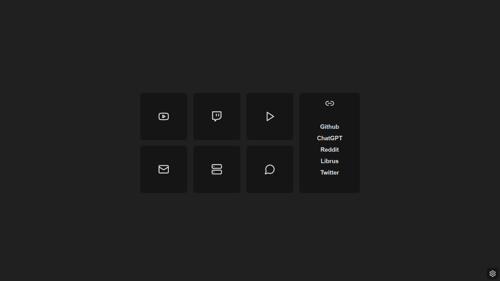

### PixelPage 2.0 is a simple and neat homepage for firefox inspired by [Bento](https://github.com/migueravila/Bento).

## Screenshots

  

## Installing

1. Go to `about:addons`.
2. Press the settings button in the top right.
3. Press "Install Add-on From File...".
4. Select the PixelPage-2.x.x.xpi file.

> This project includes portions of Lucide, which is licensed under the ISC License. \
> See the [LICENSE](./LICENSE) for details.
